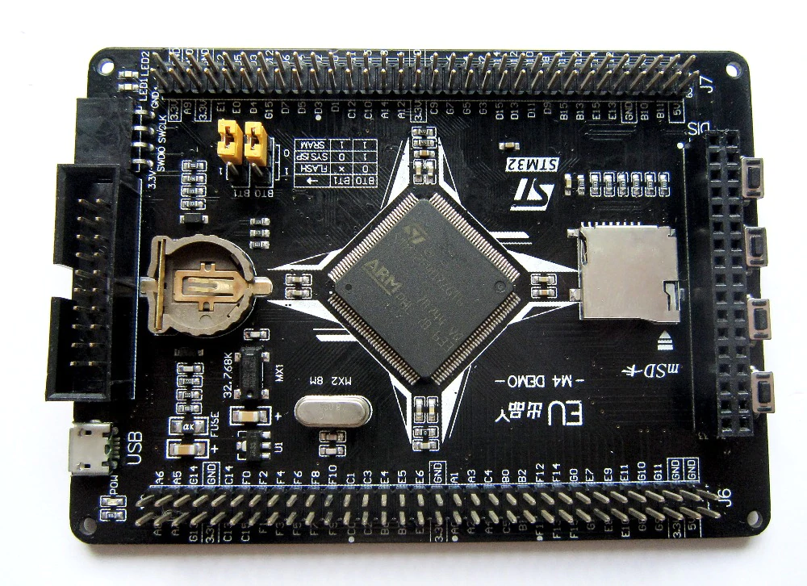
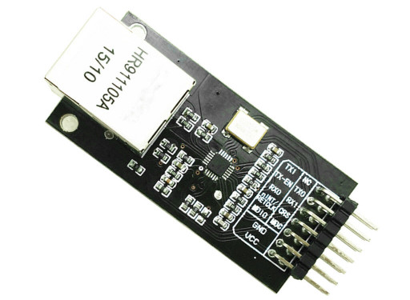
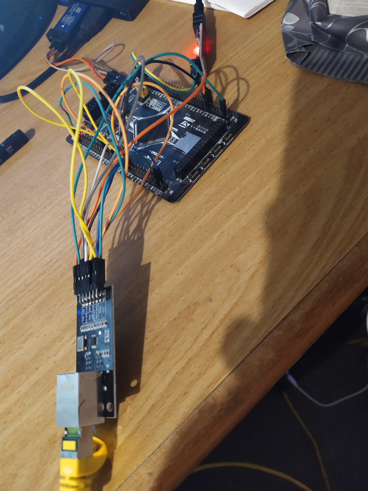

# STM32F407 Ethernet Ping Demo

## Description

CubeMX is used to genearte a project for a STM32F407 board. The ethernet peripheral of the chip is used to interface with a ethernet PHY chip via the RMII interface. The CubeMX provided lwIP stack is configured and used to send ping requests and evaluate replies.

## Hardware

* STM32F407ZG board (used: https://www.aliexpress.com/item/32761236140.html)
	* only used harwardware features are its ETH peripheral and the HSE crystal on the board
	* any other board with the same µC and exposed pins should suffice, too
	* any F4 microcontroller with a `ETH` peripheral should suffice, too 
* LAN8720A breakout board  (used: https://www.ebay.de/itm/LAN8720-Ethernet-RMII-PHY-Schnittstelle-Interface-Modul-HP-Arduino-ESP32-WS81004/283554449866)
	* already has 50MHz clock for REFCLK :)
	* similiar to LAN8742A 
	* other Ethernet PHYs configurable via CubeMX (DP83848) 
	* or manually, register offsets must be given in that case 
* ST-Link for programming 
	* can also be done via USB-DFU though 
* UART adapter for debugging 
* Ethernet cable 
* Router in home network




## Wireup 

### Ethernet PYH 

From the LAN8720 board to the STM32F407:

* REF_CLK: PA1 
* MDIO: PA2 
* CRS_DV: PA7 
* TXE: PB11 
* TX0: PB12 
* TX1: PB13 
* MDC: PC1 
* RX0: PC4 
* RX1: PC5
* VCC: 3.3V
* GND: GND 

### UART 

From UART adapter to the STM32F407:

* RX: PA9
* TX: PA10 (unused)
* GND: GND 

### STLink

From STLink SWD programmer to the STM32F407:

* SWDIO: PA13
* SWCLK: PA14 
* 3.3V: 3.3V
* GND: GND  

<picture of setup> 

## Software

### Lineup

* STM32CubeMX 5.5.0
* STM32Cube FW_F4 V1.24.2
* lwIP 2.0.3

### Configuration 

This demonstration uses no RTOS and the default lwIP stack provided by CubeMX. Only certain configurations have to be made to enable the usage of `ping_helper.c` in other projects. 

Extra `lwipopts.h` content:

```
/* we need RAW sockets for ping */
#define LWIP_RAW 1
/* more possible timers */
#define MEMP_NUM_SYS_TIMEOUT 8
/* number of allocatable raw PCB structures. must be at least one. default is already 4, ok. */
//#define MEMP_NUM_RAW_PCB 2
```

The first one must be activated so that the ping helper can use the RAW lwIP API to send and receive data. 

Second, the ping helper and demo relies on `sys_timeout` to handle ping timeouts, start the ping request and periodically check the ping result. 

### `ping_helper` API 

The ping helper files are not dependent on STM32-specifics, or an RTOS. They only rely on lwIP API calls. 

The API lets a user start a ping request by using the `int ping_ip(ip_addr_t ping_addr)` function. The target IP address is the parameter and an error value (or `PING_ERR_OK`) is returned. Since no RTOS is involved, we can't have a blocking ping function, because we need to execute the processing of the ethernet input and stack in a polling mode. 

The user should then continue processing ethernet data as normal. The status of the ping request can be obtained by calling `int ping_ip_result(ping_result_t *res);`. When this function returns `PING_ERR_OK`, the ping result information were stored in the memory pointed to by the `res` parameter. From this structure, it can be checked whether there was a ping echo reply, a timeout, or a different error. The time taken for the request in milliseconds can also be obtained.


```cpp
typedef enum {
    PING_RES_TIMEOUT,               /* no response received in time */
    PING_RES_ID_OR_SEQNUM_MISMATCH, /* response ID or sequence number mismatched */
    PING_RES_ECHO_REPLY,            /* ping answer received */
    PING_RES_DESTINATION_UNREACHABLE, /* destination unreachable received */
    PING_RES_TIME_EXCEEDED,         /* for TTL to low or time during defrag exceeded (see wiki) */
    PING_RES_UNHANDLED_ICMP_CODE,   /* for all ICMP types which are not specifically handled */
} ping_result_code;

typedef struct {
    ping_result_code result_code;
    u32_t response_time_ms;
    ip_addr_t response_ip;
} ping_result_t;
```

### Demo Execution flow: 

1. Do low-level chip initialization (`HAL_Init()`, clock)
2. Initialize GPIOs, USART1, ETH and lwIP 
3. Setup timer calls to start a new ping request every 4 seconds and to check the ping result every 100ms 
4. processes ethernet input and lwIP stack (`MX_LWIP_Process()`)
5. go to step 4

## Expected Output 

After DHCP lease has been acquired, the board should ping the IP of `google.com` (hardcoded):

```
netif: netmask of interface st set to 255.255.255.0
netif: GW address of interface st set to 192.168.1.1
netif_set_ipaddr: netif address being changed
netif: IP address of interface st set to 192.168.1.113
Starting to ping IP: 216.58.213.195.
Good ping from 216.58.213.195 26 ms
Starting to ping IP: 216.58.213.195.
Good ping from 216.58.213.195 25 ms
Starting to ping IP: 216.58.213.195.
Good ping from 216.58.213.195 72 ms
Starting to ping IP: 216.58.213.195.
Good ping from 216.58.213.195 26 ms
Starting to ping IP: 216.58.213.195.
Good ping from 216.58.213.195 26 ms
Starting to ping IP: 216.58.213.195.
Good ping from 216.58.213.195 27 ms
```

## Demo Setup 



## Quirks

### PHY Address 

The PHY address needed for communucation over the RMII interface is determined by the hardware. In my case, my LAN8720A board had its address bootstrap pin pulled high, which resulted in it having a PHY address of 1 instead of the STM32CubeMX default value of 0. 

The function `check_debug_info()` can be used to try and read out a PHY identification register (2 and 3) to check whether communication is working over that interface. If it does not, the function will print only 0xffff. Double check connections and the PHY address in that case. 

### ICMP (and probably IP, TCP, UDP, ..) checksum generation 

This is further explained in `ping_helper.c:99`. In my specific hardware and software configuration, I encountered the error that every time I sent a ICMP packet with my calculated checksum, the checksum was **zero** when it reached the router (checked via `tcpdump`). It seems so that the hardware does all checksum calculations itself and you **must not** calculate the ICMP checksum yourself. The solution is to explicitly set the checksum to zero.

I have no idea whether there is a configuration switch for this, but it seems to be in the hardware -- I debugged the contents of the buffer in the `ETH` peripheral, the lowest-possible level, and it did have a correct checksum, while the data sent over the wire did not. Either the µC or the PHY will do the ICMP checksum calculation here, and very likely in IP, TCP and UDP, too. 

If it is observed that no ping reply is received, double check which packets are received by the router and re-enable software checksum calculation if needed. 

